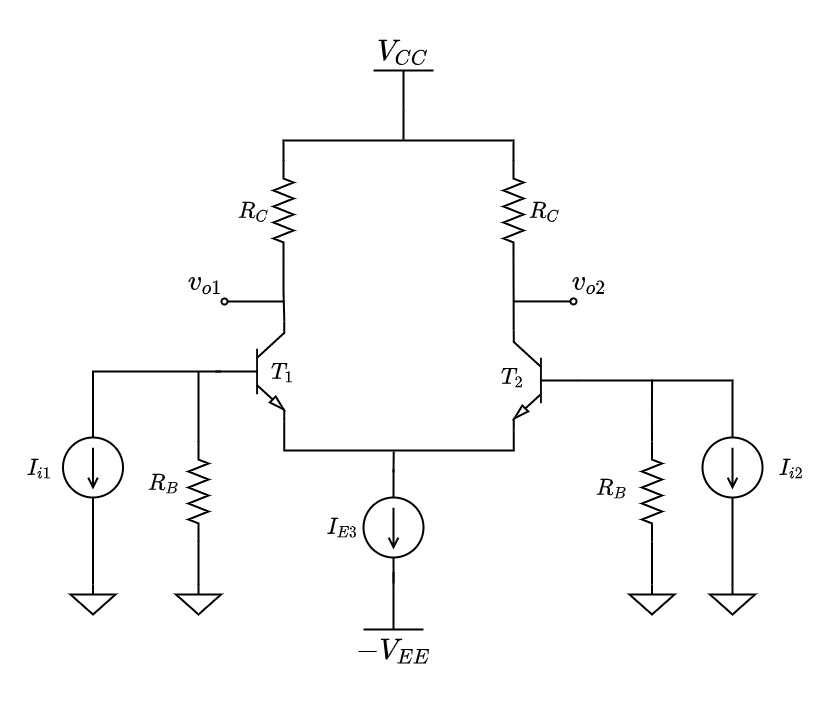

<h1 align="center">Current source for differencial amplifiers</h1>

In this repository you will find information about the design of current sources for differetial amplifieres. 
<h1 align="center">
	
</h1>
Here is the link of the complete file [file pdf](https://www.overleaf.com/download/project/62c6e744296e0d39db8af34f/build/181db104abb-7a1406581c71c948/output/output.pdf?compileGroup=standard&clsiserverid=clsi-pre-emp-e2-f-lz1j&popupDownload=true)
